<p align="center">
  
</p>

<h1 align="center">AlarmTracker</h1>

<p align="center">
  <b>The alarm that doesn't fail quietly — and that can ring for things a clock can't know about.</b>
</p>

<p align="center">
  Android 9+ · Kotlin · no account · no ads · no API keys · nothing leaves your phone unless you ask it to
</p>

---

## Contents

- [Why this exists](#why-this-exists)
- [Problems, and what solves them](#problems-and-what-solves-them)
- [Screenshots](#screenshots)
- [Setup](#setup)
- [Permissions, and why each one is asked for](#permissions-and-why-each-one-is-asked-for)
- [Check that it actually works](#check-that-it-actually-works)
- [Troubleshooting](#troubleshooting)
- [How it's built](#how-its-built)
- [Continuous integration](#continuous-integration)
- [Licence](#licence)
- [What's verified on real hardware, and what isn't](#whats-verified-on-real-hardware-and-what-isnt)
- [Privacy](#privacy)

---

## Why this exists

Two things go wrong with phone alarms, and neither is your fault.

**They fail silently.** Android hands alarms to the OS, but every manufacturer layers its own
battery-saving on top. On Xiaomi/MIUI, Oppo, Vivo, Samsung and others, an app can be frozen, denied the
right to show a screen over your lock screen, or killed outright — and the alarm app has no way to tell
you. You find out when you wake up two hours late. Stock alarm apps don't explain it, and third-party
ones usually just say "please whitelist us" in a footnote.

**Half of what you need to wake up for isn't a time of day.** "Wake me when I'm nearly at my stop."
"Wake me when the delivery actually arrives." "Wake me when the build finishes." "Wake me when my quota
is back." A clock can't express any of those, so you either set a pessimistic alarm and lose the
difference, or you sit there watching a progress bar.

AlarmTracker is built around exactly those two problems: **prove the alarm will fire**, and **let the
alarm be triggered by something real instead of only by a time**.

---

## Problems, and what solves them

### 1. "My alarm just didn't go off"

**The problem.** The alarm existed, was switched on, and nothing happened. Or it rang but showed only a
notification you couldn't act on from the lock screen — on Android 14+, permission to show a
full-screen alarm is **denied by default**, and on MIUI an app additionally needs "Display pop-up
windows while running in the background" before it may put anything on screen at all.

**What AlarmTracker does.**

| | |
|---|---|
| **Exact, OS-level scheduling** | Every alarm is an `AlarmManager.setAlarmClock()` — the one API Android will not defer for battery reasons, and the one that shows in the system's own next-alarm slot. Ringing runs as a foreground service, so it survives the app being swept away. |
| **A first-run setup gate** | The permissions that decide whether an alarm can ring are collected up front, with the reason for each, instead of being buried in settings. |
| **Health check** | A live checklist: exact alarms, notifications, full-screen permission, alarm volume, battery optimisation, Do Not Disturb, overlay. Each row deep-links straight to the switch that fixes it. |
| **Missed-alarm postmortem** | When an alarm is missed or fires late it is logged with *why* — phone off, rang out unheard, permission revoked, battery restriction, DND, volume at zero, OEM kill. You get an explanation, not a mystery. |
| **Works on any phone, not just the ones we own** | The app *asks the device* which background-restriction screen it has rather than matching a brand name, so a rebadged ROM or an unheard-of manufacturer still gets sent to the right settings page — and a button is never offered that would open nothing. Known skins (MIUI/HyperOS, EMUI/MagicOS, ColorOS, Funtouch/OriginOS, OxygenOS, One UI, ZenUI, Transsion, Flyme…) additionally get wording that names their exact toggles. A phone with no such screen — a Pixel, an AOSP build — is asked for nothing extra. |
| **Battery exemption you can see** | One row in Settings → Reliability shows the current state and asks Android directly for the exemption (an alarm clock is one of the few apps that legitimately qualifies). |
| **Nightly pre-flight** | A background check runs once a day and tells you if something has changed under you *before* the alarm you're relying on. |

### 2. "I switched it off in my sleep and don't remember doing it"

**The problem.** The dismiss button is one tap away from your thumb, and at 6am your brain will take it
without consulting you.

**What AlarmTracker does.** A per-alarm **mission** you must complete before it stops:

- **Maths** — arithmetic at three difficulties.
- **Puzzle** — tap tiles in order, or find the odd one out.
- **QR / barcode** — register a code stuck to the bathroom mirror or the kettle; you have to walk there and scan it.
- **Steps** — take 10/20/30 real steps, counted by the step sensor. The alarm **quietens while you're
  moving and swells back up when you stop**, so walking is rewarded and standing still isn't.
- **Photo** — match a photo of a place in your house (only a perceptual hash is stored, never the image).

Two deliberate safety valves: every mission has a **"Solve maths instead"** escape, so a broken camera
or a dead sensor can never trap you with a ringing phone — and missions are the only thing gating
dismissal, never the ring itself.

Also here: **gentle wake** (a silent sunrise glow that brightens the screen before the ring),
**volume ramp** (missions start quiet and grow), **vibration modes** (off / with sound / vibrate only),
**snooze length or no snooze at all**, **volume-button snooze**, and a **weekly snooze budget** that
shortens your snoozes once you've spent it.

### 3. "I don't know what time to set — it depends on traffic"

**The problem.** You're on a bus, or driving somewhere you've never been, and you want to be woken
*near the destination*. A fixed time is a guess, and a guess that's ten minutes pessimistic every day
is a lot of lost sleep.

**What AlarmTracker does.** Pick **"Arrive at a place"**:

- Search by name, or **drop a pin on a map** (OpenStreetMap tiles, no API key, no billing). Search is
  biased to where you are, tolerates misspellings, and shows how far away every result is — so a
  same-named junction 200 km away can't quietly become your destination.
- It draws the **real road route** and its drive time, then offers **"Set the alarm to 7:35"** so the
  fallback time stops being a guess.
- An **alert ring** you can see on the map (**150 m – 10 km**, one-tap presets at 200 m / 500 m / 1 km /
  2 km / 5 km / 10 km) with what it means in minutes: *"Alert me within 800 m · about 2 min before I
  arrive."* Wide rings are for trains and coaches — at 90 km/h a 2 km ring gives you 80 seconds, and a
  small ring can be crossed between the OS's location samples and never trigger at all.
- If the ring you chose **already contains you**, saving says so instead of ringing immediately.
- Arrival is detected by an **OS geofence**, not by polling. Your phone is not tracking you; the system
  wakes the app when the boundary is crossed. A sparse ETA check only runs when a destination alarm is
  armed and due within six hours.
- **One safety rule:** a refined ETA may only ever move the alarm **earlier** than your fallback time,
  never later. Otherwise sitting in traffic would push your alarm back forever.

### 4. "The thing I'm waiting for doesn't have a clock time"

**The problem.** The food arrives when it arrives. The train gets in when it gets in. The build
finishes when it finishes. You want to stop watching and be told.

**What AlarmTracker does.** Pick **"When a notification appears"** and it rings on a real notification
from a real app:

- One-tap presets for **a task finishing**, **a delivery arriving** (the big couriers and quick-commerce
  apps, plus content matching so a regional app still works) and **a train or bus arriving**.
- **"Trackable right now"** lists whatever is on your notification shade at this moment. **Track** takes
  the app's own best guess in one tap; tapping the row instead opens the choice, so you can see what it
  will match on before committing. The armed row is outlined and reads **Tracking ✓**.
- **"Track any app's notification"** — choose any installed app, then answer one question in plain
  language:

  | Choice | When it rings | Words needed |
  |---|---|---|
  | **When it says something specific** | On wording like "delivered", "is here", "has reached" | None — they come pre-ticked, untick what doesn't fit |
  | **When it finishes** | The app's ongoing notification disappears (a download, a build, a trip) | None |
  | **On its very next notification** | The next thing that app posts, whatever it says | None |

  If that app is showing a notification *right now*, its real text appears in the dialog, so the choice
  is made against actual wording rather than an imagined one.
- It also refines: a navigation notification counting down "14 min" moves the alarm to match.
- **"Ring anyway after 30 min"** — the backstop is a wait measured from now, not a time of day,
  because that's the shape of this kind of waiting. Adjustable from 5 minutes to 4 hours, or switch it
  to a wall-clock deadline if you'd rather.
- **"Is this working?"** — the honest bit. Notification tracking is invisible until it fires, so there's
  a check that reports whether access is on, whether Android has actually started the listener, **how
  many notifications have reached the app and when the last one was**, whether the app you're watching
  is even installed, and whether your rule matches anything on screen right now.

Costs while it waits: **nothing**. There is no polling, no timer and no wakelock. Android pushes
notifications to the app; the work per notification is a package check and a text comparison.

> **A note on why the wording question moved out of the user's hands.** An earlier build asked you to
> type "the words that mean done" before it would arm. That is an unanswerable question — nobody knows
> what phrasing their courier app uses until the order turns up, and a wrong guess is an alarm that
> silently never fires. It was tested against a real delivery: the only phrase that matched was
> **"is here"**, because Indian quick-commerce apps say *"delivery partner has reached"* or *"rider is at
> your gate"* rather than the *"delivered"* that most Western couriers use. Both halves of that were
> fixed — those wordings are now in the built-in list, and the question you're asked is a choice between
> three plain-language options rather than a blank text field.

### 5. "Ring me when my usage limit comes back"

**The problem.** You hit a daily limit — an AI assistant, image credits, a game's energy, a streak —
and the reset time is buried in a message you'll have closed by then.

**What AlarmTracker does.** **"When a limit resets"** with presets for AI assistants, credit-based
tools, games and daily puzzles. A guaranteed timer is set immediately, and if a "resets at 3:30 PM"
message shows up it's parsed and the timer is corrected. Notification-first, timer-backed — so it works
even if nothing is ever detected. When it rings, a button drops you straight into the app.

### 6. "It rang in the middle of a meeting and everyone on the call heard it"

**The problem.** An alarm on the loudspeaker plus an open microphone means the whole call hears your
alarm. No app can filter that out of the audio the other side receives — it's acoustics, not routing.

**What AlarmTracker does.** It notices you're in a call or a conference (any app — Teams, Meet, Zoom,
WhatsApp, a normal phone call — no per-app list needed), then:

- routes the alarm to a **wired, USB or Bluetooth headset** if there is one, and **verifies** the audio
  didn't silently fall back to the loudspeaker;
- if there's no private output, **plays no sound at all** and **forces vibration on** instead — even if
  that alarm has vibration switched off — while still showing the full ring screen;
- shows why, with a **"Play sound anyway"** button;
- **un-mutes itself within a few seconds of the call ending.**

### 7. "He said he was two minutes away — he was at home" · "Did she get to school?"

**The problem.** Two problems that look different and are the same underneath. You wait outside for
twenty minutes on a friend's word. Or someone you look after is travelling and you don't want to text
them five times — you want to know when they *actually* got there. Both are: **a person, a place, and a
boundary being crossed.** The only real difference is urgency: a friend running late is a notification,
and a child reaching (or leaving) somewhere has to be able to reach you when the phone is face-down in
another room.

**What AlarmTracker does.** Pair with someone under **People**, then set watches on places that matter:
*arrived*, *left*, or *within 100 m*. Each contact is marked as one of two things, which changes the
defaults and nothing else:

| | Meeting up | Someone I look after |
|---|---|---|
| Alert | Notification | **Rings like an alarm** — full screen, over the lock screen, ignores silent |
| Share windows | 30 min – 4 h | 1 h, 4 h, 8 h, or **until they turn it off** |
| On the alert | — | **Call them**, or **Ask where they are** |

"Ask where they are" is a poke over the same encrypted channel: their phone says *"X is asking where you
are"* — no call to answer, no location demanded. And you can send it from the People screen any time,
not just from an alert.

The design matters more than the feature, and it's the same for both:

- Watches are sent to **their** phone and armed there as **OS geofences**, so an armed watch costs
  almost nothing and **nobody is continuously tracked**. Your phone isn't polling theirs; the system
  wakes their app when a boundary is crossed.
- Pairing is two-sided, and **pairing alone shares nothing**.
- **Only they can start sharing**, deliberately, with a notification on screen the whole time and Stop
  one tap away. A "care" contact gets longer windows — a school run that expires halfway through is
  worse than useless — but never a silent or automatic share. That would make it a tracking device
  instead of a safety feature, and the app refuses to be one.
- Everything is **encrypted on the phone before it's sent**; the relay only ever holds ciphertext.
  Removing someone destroys the key.
- An alert firing during a call is muted or sent to your headset, exactly like an alarm — the same
  meeting-aware rule from section 6 applies.

### 8. "My actual deadlines live in Jira, not in my alarm app"

**The problem.** The thing you must not forget is a ticket due date, and your alarm app has never heard
of it.

**What AlarmTracker does.** Connect Jira with a personal API token (no OAuth broker, no server of ours,
your organisation's Jira stays yours) and tickets due soon become alarms automatically — rescheduled if
the date moves, removed if the ticket is closed. Polling is deliberately infrequent and
user-configurable (morning-only by default) plus a manual "Check now". Google Calendar works today
through the device's own synced calendar, no login required.

### 9. "I still need the rest of a clock app"

- **Timers** — as many as you like, each with a label, editable, with a bin and undo. A finished timer
  **rings like an alarm** (full-screen over the lock screen), can be **snoozed**, and can **open an app**
  when it ends — "open the camera when the 3 minutes are up".
- **Stopwatch** — laps in aligned columns, and a **lap-record export** you can share as a clean text
  table. Stock stopwatches lose your splits the moment you close them.
- **World clock** — your cities with the day difference, and a **converter**: "I want to call him
  tomorrow morning — what time is that here?", answered both directions.
- **Stats** — a Wake Score, wake-time trend and snooze history, from your own data.

### 10. "Where is my data, and what happens when I delete something"

Everything lives on the phone in a local database. No account, no sign-in, no analytics, no ad SDK.
Deleted alarms and timers go to a **recycle bin** first (7 days for repeating alarms, 1 day for
one-shots) so a mis-swipe isn't a loss. You can **export everything as CSV** or **wipe all of it** from
Settings. Tokens are held in the Android Keystore, excluded from backups, and plaintext HTTP is blocked
outright.

### 11. "It just didn't say anything when I had no internet"

**The problem.** With Wi-Fi and data off, an app that needs the network should say so. Instead you get
silence — or worse, a message blaming you.

**What AlarmTracker does.** It tells you which of three things is actually true, and offers the switch:

- **offline or in airplane mode** → what needed the connection, and a **Turn it on** button that opens
  Android's internet panel over the app;
- **connected to a Wi-Fi with no working internet** (the hotel/café sign-in page) → says exactly that,
  and still attempts the request;
- **online but the service didn't answer** → says the service is at fault, not you.

Alarms themselves never need a connection. Only the map, place search, routing, Jira and friend alerts do.

---

## Screenshots

All taken on the phone this is developed against — a Redmi Note 11 Pro on Android 13, MIUI.

<p align="center">
  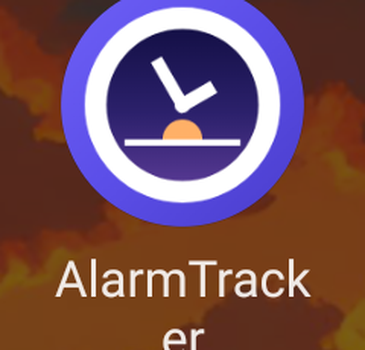
</p>

| Alarms | Track an event |
|---|---|
| 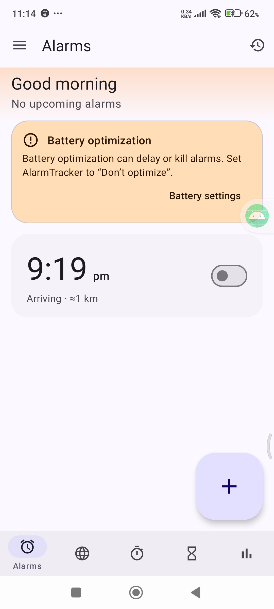 | 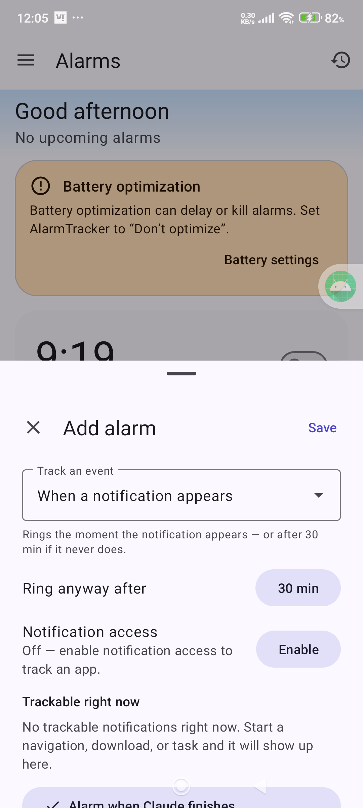 |
| The amber banner is the reliability advisory — battery optimisation still needs turning off on this phone. The row under it is an **arrival alarm**: a fallback time with a live distance attached. | The backstop for a tracked notification is **a wait from now, not a time of day** — "Ring anyway after 30 min". Notification access is off here, which is why nothing could be tracked yet. |

| Arrive at a place | No internet |
|---|---|
| 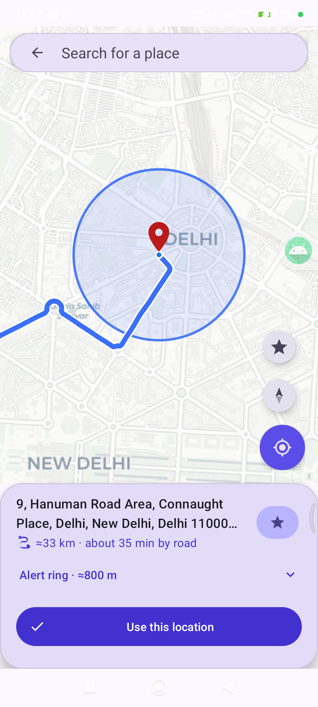 | 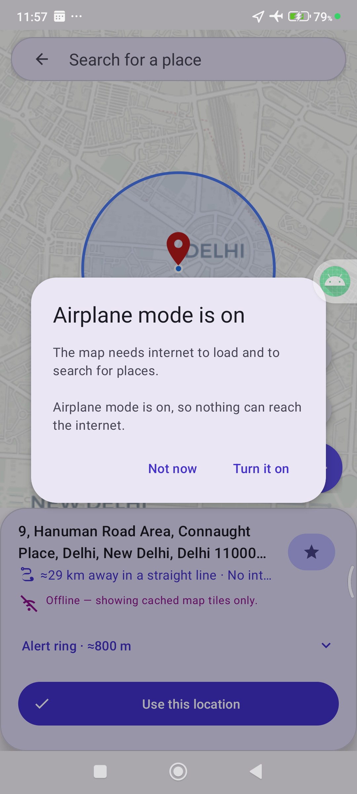 |
| Pin, **real road route** with its drive time, and the **alert ring** drawn to scale so the radius means something. Keyless OpenStreetMap tiles. | The same screen with the radios off: it names what needed the connection and offers the switch, instead of failing silently or blaming your search. |

| Is it working? | Health check |
|---|---|
| 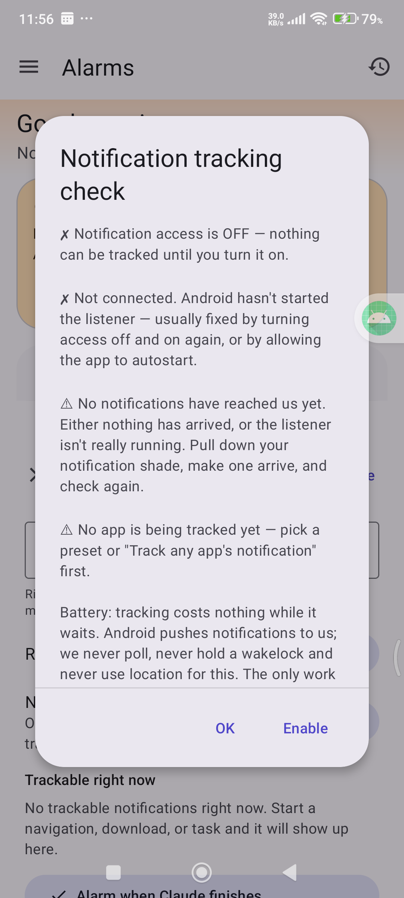 | 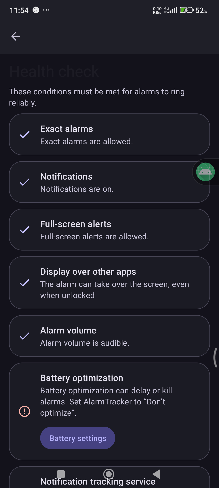 |
| Notification tracking is invisible until it fires, so it can be checked: access, whether Android actually started the listener, **how many notifications have reached the app**, and whether the watched app is installed. | Every condition that decides whether an alarm can ring, each row deep-linking to the switch that fixes it. |

| People | A timer that rings like an alarm |
|---|---|
| 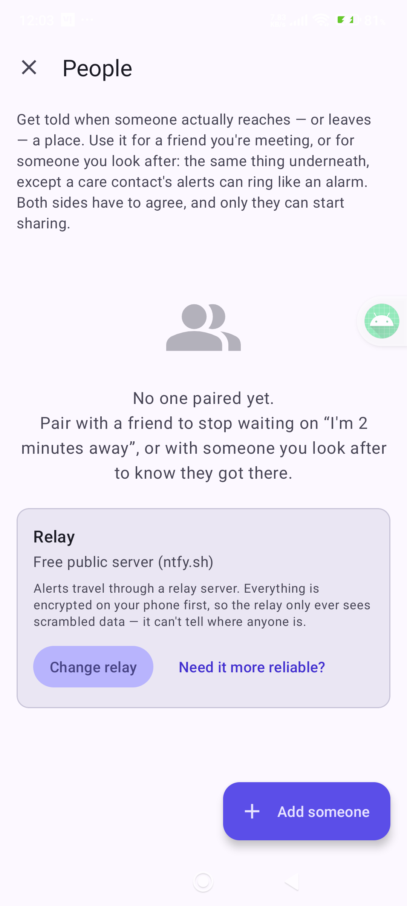 | 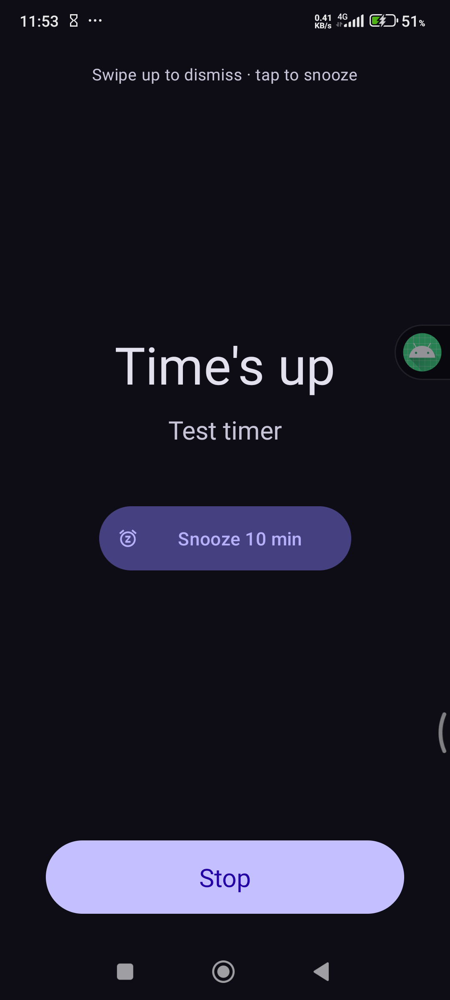 |
| Pair with a friend you're meeting or someone you look after. Alerts travel through a relay that only ever sees ciphertext. | A finished timer takes the screen over the lock screen, and is dismissed the same way an alarm is: swipe up, or tap to snooze. |

| When should this ring? | Which one did you mean? |
|---|---|
| 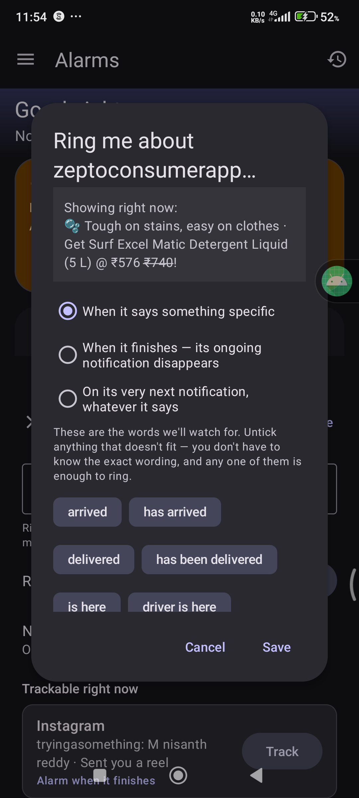 | 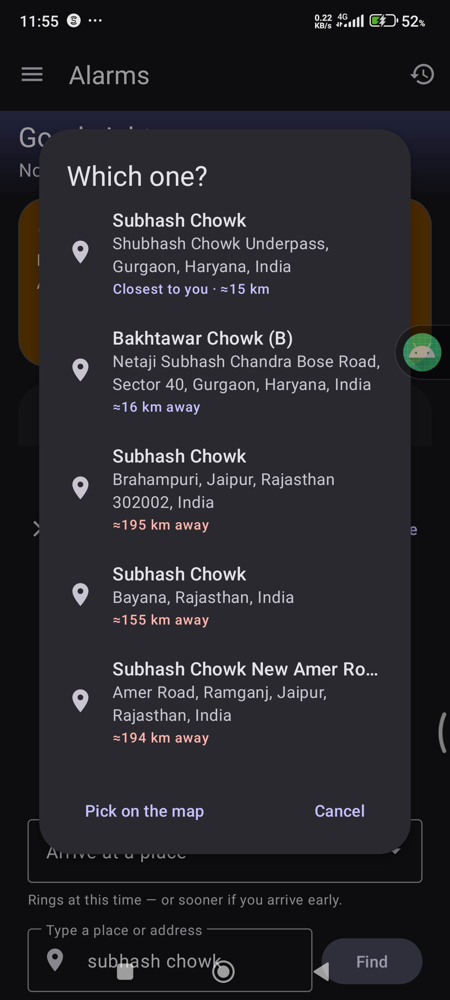 |
| Choosing what a tracked app has to say. The words are pre-ticked from what the app knows about delivery apps, and the notification that app is showing *right now* is quoted above them, so it isn't guesswork. | Real output for "subhash chowk": the Gurugram junction first at "Closest to you", the same-named junctions in Rajasthan demoted and shown in red at ~195 km. |

---

## Setup

### What you need

- **Android 9 (API 28) or newer** on the phone
- **JDK 17+** and the **Android SDK** (platform 37) on the computer — Android Studio installs both
- A USB cable, and **USB debugging** turned on in Developer options

There is no Play Store listing yet; you build and side-load it.

### 1. Build

```bash
git clone https://github.com/<your-account>/AlarmTracker.git
cd AlarmTracker
./gradlew :app:assembleDebug          # Windows: .\gradlew.bat :app:assembleDebug
```

The APK lands at `app/build/outputs/apk/debug/app-debug.apk` (about 50 MB debug, ~90 s cold).

No configuration step, no `.env`, no API keys to obtain: a fresh clone builds as-is. Gradle writes
`local.properties` with your SDK path on first run, and that file is gitignored on purpose.

### 2. Install

```bash
adb devices                      # confirm the phone is listed, accept the USB-debugging prompt
adb install -r app/build/outputs/apk/debug/app-debug.apk
```

> **Xiaomi / MIUI:** if this fails with `INSTALL_FAILED_USER_RESTRICTED`, the phone is waiting for you
> to accept an **"Install via USB"** dialog on screen. Accept it and run the command again. You may also
> need *Developer options → Install via USB* enabled.

### 3. First run

The app opens a short setup flow before you can use it. This is deliberate — every step is something
that decides whether an alarm can actually ring, and skipping them is how alarm apps fail silently.

1. **Welcome** — what the app is for.
2. **Reliability setup** — grant the permissions, each with its reason. Two are **required** to continue:
   **Display over other apps**, and (on manufacturers that have it) an acknowledgement that you've
   enabled **Autostart**. The rest are strongly recommended and can be fixed later from Health check.
3. **Ready** — you land on Alarms with an empty list and a **+** button.

Then a three-step walkthrough points out the **+** button, the tabs and the row gestures. You can replay
it any time from *Settings → Help → Show tips again*.

### 4. Extra toggles per manufacturer

Stock Android needs nothing beyond step 3. Skinned Android does, and the app deep-links you to each one:

| Phone | Where | What to turn on |
|---|---|---|
| **Xiaomi / Redmi / POCO (MIUI, HyperOS)** | Settings → Apps → AlarmTracker → Other permissions | **Display pop-up windows while running in the background** (this is the important one), **Show on lock screen**, and **Autostart** |
| **Samsung (One UI)** | Settings → Battery → Background usage limits | Remove AlarmTracker from *Sleeping* and *Deep sleeping* apps |
| **Oppo / Realme (ColorOS), Vivo (Funtouch/OriginOS)** | Battery / App management | Allow **background running**, **autostart**, and display over other apps |
| **OnePlus (OxygenOS)** | Battery → Battery optimisation | Set AlarmTracker to **Don't optimise** |
| **Huawei (EMUI)** | Battery → App launch | Switch AlarmTracker to **Manage manually**, all three toggles on |
| **Android 14+, any brand** | Settings → Apps → AlarmTracker → **Full-screen notifications** | On — without it, an alarm can only post a notification, never take over the lock screen |
| **Anything else** | The app finds it for you | Health check probes your device for a background-restriction screen and links straight to it. If your phone has none, there is nothing extra to do |

---

## Permissions, and why each one is asked for

| Permission | What breaks without it | Optional? |
|---|---|---|
| Notifications | Nothing rings visibly | No |
| Exact alarms | Alarms get deferred by the system | No |
| **Full-screen notifications** | An alarm shows as a notification only, never a full ring screen on the lock screen | No, in practice |
| **Display over other apps** | The ring screen can't appear while the phone is unlocked and in another app | No, in practice |
| Battery optimisation exemption | The app can be frozen and miss alarms entirely | Strongly recommended |
| Autostart (manufacturer-specific) | Alarms stop working after a reboot or an app kill | Strongly recommended |
| Location — *while using the app* | No map position, no route, no distance estimate | Only for arrival alarms |
| Location — *all the time* | Arrival can't be detected in your pocket with the app closed | Only for arrival alarms and friend watches |
| Notification access | Notification- and limit-reset alarms can't see anything | Only for those two modes |
| Calendar | Calendar-driven alarms can't read your events | Only for calendar alarms |
| Camera | QR and photo missions can't run | Only for those missions |
| Physical activity | The steps mission can't count steps | Only for that mission |
| Health Connect (sleep) | Sleep estimates fall back to screen-off/unlock times | Fully optional |

Nothing here is used for anything other than the feature it's listed against. Notification access reads
notification text **only** to match rules you created yourself, and nothing about them is ever sent
anywhere.

---

## Check that it actually works

Don't take an alarm app's word for it. Five minutes, in this order:

1. **Health check** — sidebar → *Health check*. Everything green, or fix what isn't from that screen.
2. **A real alarm, locked.** Set one two minutes out, **lock the phone**, and put it down. You should
   get the full ring screen over the lock screen with Snooze and Dismiss, not a notification.
3. **Snooze paths.** While it rings, try the volume button, and try a single tap.
4. **A mission.** Set an alarm one minute out with the maths or steps mission, and confirm you can't
   dismiss it without doing the thing — and that "Solve maths instead" gets you out if a sensor misbehaves.
5. **Notification tracking**, if you plan to use it: editor → *Track an event → When a notification
   appears* → **Is this working?**. Note the count, make any notification arrive on the phone, check
   again. Count went up = the mechanism is alive.
6. **A timer**, if you use them: 30 seconds, lock the phone, confirm it rings like an alarm.

After a phone update or a MIUI update, re-run steps 1 and 2 — updates routinely reset these permissions.

---

## Troubleshooting

| What you see | Why | Fix |
|---|---|---|
| Alarm rang but only as a notification | Full-screen permission denied (default on Android 14+), or MIUI blocking background pop-ups | Grant *Full-screen notifications*; on MIUI also *Display pop-up windows while running in the background* |
| Nothing rang at all | App frozen by battery saving, or autostart off | Battery exemption + autostart; then read *Settings → Missed alarm reports*, which will name the cause |
| No way to stop a ringing alarm | Old build without the ring screen | Reinstall the current build; the ring screen has large Snooze/Dismiss, plus volume-button snooze |
| "Couldn't get a location fix" | **The phone's Location switch is off** — no app can get a fix, and search silently goes worldwide | Turn Location on in quick settings. The app now says this explicitly and links you there |
| Place search returns other cities | Search needs a reference point; with Location off there isn't one | Turn Location on. Results are ranked nearest-first and every row shows its distance |
| Map is blank | No internet, or tiles still loading | The map now says "Offline" and offers to open the internet panel |
| Notification alarm never fired | Access revoked, listener not started, or the watched app isn't installed | *Is this working?* in the editor will say which |
| Notification access is on, but nothing is ever tracked | **Your phone has approved the listener and never started it.** Measured on MIUI: the app appears in the system's *enabled* listener list but not its *live* one. Xiaomi's own listener has the same problem there | Health check shows a **Notification tracking service** row when this happens. Enable **Autostart** for the app, then toggle notification access off and on. The app asks Android to rebind on every launch, but a skin can refuse |
| Notification alarm never fired, everything else looks fine | The app's wording didn't match. Couriers vary wildly — "has reached", "at your gate", "handed over" | Re-open the row and pick **On its very next notification**, which needs no wording at all |
| Tapping **Track** looked like it did nothing | Fixed. The confirmation used to be a line of text below the fold of the sheet | The row now reads **Tracking ✓**, and a toast confirms it |
| People alerts arrive late | Discovery is a 15-minute poll when no session is live | Open the People screen to sync at once; alerts inside a live session arrive in about a minute |
| A person alert didn't wake you | That watch isn't marked alarm-grade | Tap the watch → **Ring like an alarm**. It's on by default only for a "someone I look after" contact |
| Alarm leaked into a meeting | Meeting-aware ringing off, or no headset connected | It's on by default; with no private output it vibrates instead of playing |
| `INSTALL_FAILED_USER_RESTRICTED` | MIUI wants an on-screen confirm | Accept "Install via USB" on the phone and retry |

---

## How it's built

```
app/src/main/java/com/example/alarmtracker/
  data/         Room entities, DAOs, repository            (database version 11)
  scheduling/   AlarmScheduler · EventAlarmCoordinator · geofences · live-ETA
  ring/         AlarmReceiver → foreground service → full-screen ring activity
  notif/        NotificationListenerService · presets · ETA and reset-time parsers
  connector/    Connector framework + Jira, WorkManager polling
  friends/      pairing, client-side crypto, encrypted relay transport, geofences, alert ring
  ui/           alarms · map · timer · stopwatch · worldclock · stats · settings · health · help
  util/         Reliability · NetworkState · PlaceSearch · RouteService · Prefs · Format
docs/           design decisions, roadmap, checkpoint notes
snapshots/      zipped source + APK restore points
```

Kotlin, views + view binding (no Compose), Room with KSP, WorkManager, Material 3. Maps are
[osmdroid](https://github.com/osmdroid/osmdroid) with Carto's key-free tiles; search is the framework
geocoder merged with [Photon](https://photon.komoot.io/); routing is keyless OSRM. **No API keys and no
backend of ours anywhere.**

Build gotchas worth knowing before you touch the Gradle files:

- **AGP 9.2 has Kotlin built in** — do not add the `kotlin-android` plugin.
- KSP needs `android.disallowKotlinSourceSets=false` in `gradle.properties`.
- The preference library binds switches to `@id/switchWidget`, not `@android:id/switch_widget`.
- `lint { disable += "RepeatOnLifecycleWrongUsage" }` is a workaround for a crash inside the
  androidx.lifecycle lint artifact — remove it once that's fixed.
- **This project is not a git repository yet.** `snapshots/` holds zipped restore points, which is not
  the same thing. Fixing that is the highest-value housekeeping left.

Useful commands:

```bash
.\gradlew.bat :app:assembleDebug        # build
.\gradlew.bat :app:lintDebug            # lint (currently 0 errors, 136 warnings)
adb logcat -d | Select-String FATAL     # crash check after install
adb shell settings get secure location_mode   # 0 = Location off; check this before any location bug
```

### Continuous integration

`.github/workflows/android.yml` builds the debug APK, runs lint and runs the unit tests on every push
and pull request, then uploads the APK and the lint report as artifacts.

**It needs no repository secrets.** There are no API keys, no service accounts and no backend, so a fork
builds it unchanged. The only thing that would ever need secrets is *signing a release*, and the
workflow carries a commented-out job listing exactly which four to add if you get there.

### Credentials, and what never belongs in this repo

| Thing | Where it lives | In git? |
|---|---|---|
| Jira API token | The app's own encrypted preferences on the phone, wrapped by an Android Keystore key | No — the user types it into the app |
| ntfy relay token (optional) | Same | No |
| Friend pairing keys | Same, one per contact | No |
| Android SDK path | `local.properties`, generated locally | No — gitignored |
| Release keystore | Wherever you keep it, backed up off-machine | **Never.** Gitignored by extension, and it cannot be regenerated |

Nothing in the source tree is a secret. Every network endpoint is public and keyless
(`photon.komoot.io`, `routing.openstreetmap.de`, `basemaps.cartocdn.com`, `ntfy.sh`), and the Jira host
is whatever the user types.

### Licence

There is deliberately **no LICENSE file yet**, which under copyright law means all rights reserved —
people may read the code on GitHub but not reuse it. That's the reversible default. If you want it to be
open source, add one:

- **MIT** — anyone may use, modify and *republish* it, including as their own paid app. Simplest, most permissive.
- **Apache-2.0** — like MIT plus an explicit patent grant and a requirement to state changes.
- **GPL-3.0** — derivatives must also be open source. The usual pick if you don't want a closed fork of your work on the Play Store.

Pick one before you accept a pull request from anyone, because without a licence the contributor's
copyright position is unclear.

---

## What's verified on real hardware, and what isn't

Tested on a **Xiaomi Redmi Note 11 Pro, Android 13, MIUI/HyperOS**.

**Verified working on the device:** install and launch with no crash, all database migrations up to v11,
the full-screen ring over the lock screen (once the MIUI toggles are on), the tab bar and every tab
layout, the map with tiles, the alert ring, the app icon in the drawer and the splash, dark and light
themes, and:

- **a timer firing end to end** — scheduled, the receiver woke, the foreground service started, and the
  full-screen ring took over the screen by itself with no app in the foreground;
- **place search relevance with live providers**, from the author's real position: "subhash chowk"
  returns the Gurugram junction first at ≈15 km and pushes the Rajasthan namesakes to the bottom at
  ≈195 km, flagged in red;
- **the tracked-notification condition picker** against a real delivery app's live notification;
- **Health check** listing every condition, including the notification-listener row below.

**Not yet verified on hardware — treat as unproven:** a geofence crossing actually firing an arrival
alarm end to end, a live notification match firing (delivery, transit, task-done), a limit-reset
notification being parsed in the wild, connector-created alarms from a real Jira account, person
crossing alerts between two paired phones (both the notification and the alarm-grade ring), the
call/ask buttons on that alert, and meeting-aware muting during a real call.

Two paired phones is the honest gap in the People feature: everything either side does has been
exercised in isolation, but the full loop — they cross a geofence, their phone publishes, your phone
rings — needs a second device and has never been run.

Also honest about it: there is **no automated test suite** — one template unit test file, and that's it.
Everything above was verified by reading the code and by tapping a phone.

---

## Privacy

- No account, no sign-in, no analytics, no advertising SDK, no crash reporting.
- Alarm data, stats and sleep signals never leave the device. Export and wipe are both in Settings.
- Place search, routing and map tiles send *only* the query or the tile coordinates to keyless public
  endpoints, and only when you use those screens.
- Friend location sharing is encrypted on your phone before it is published; the relay stores
  ciphertext it cannot read, sharing is time-boxed and expires by itself, and removing a friend destroys
  the key.
- Notification access reads notification text only to match rules you created, on the device, and
  transmits nothing.
- Secrets (Jira token, relay token) are wrapped by a non-exportable Android Keystore key and excluded
  from cloud backup. Cleartext HTTP is blocked by network security config.
